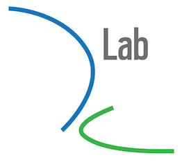

# Collaborating on GitHub

This is a one-hour introduction to collaborating on [GitHub](https://github.com/).

Modern software and data science is driven by collaboration. Gone are the days of the (image of the) lone developer, hidden away in their basement, writing code and surviving only on pizza, only to emerge a week later with flawless and fully-featured software. Today, we acknowledge that working together we can achieve more. In short, collaboration means better software and better science.

This tutorial is desgined to be interactive, practical and task-driven. We've replaced slides and lectures with discussion questions and real-life tasks.

## Goals

By the end of this workshop, you will:

- Be able to explain and motivate core concepts used to collaborate on GitHub.
- Have experience implementing a practical collaborative workflow.
- Be ready to contribute to open source projects.
- Know how to continue learning about collaboration on GitHub.
- :dizzy: Know how to use emojis on GitHub :+1:
- Know your fellow workshop participants.

## Structure

There are five parts to this tutorial. It's OK if we don't get through all of them, as all of the resources will remain here for you to peruse after today. The five parts are:

1. **Explain** 
    - In this part, you'll work in your pair to explain fundamental concepts of GitHub and its collaboration features. 
2. **Answer** 
    - Test your knowledge of collaborating on GitHub by discussing these questions with the group via GitHub issues.
3. **Define, motivate and perform**
    - Time to put your knowledge to practice! But before you perform these tasks, make sure you can succintly define them and articulate why you'd do them.
4. **Squash the bug**
    - Oh-uh, there's a few bugs in our code! Using a collaborative workflow, help us squash the bugs.
5. **Final questions**
    - Any last questions? Post them as an issue and see who else in the group can help you out.

## Setup

We'll be working in pairs and small groups for today. To complete the activities, at least one of you will need to already:

1. Have git installed
2. Have a GitHub account

If neither of you in your pair meet these requirements, follow the instructions [here](setup.md) to get set up. If you don't have these set up today but are working with someone who does, you can follow those instructions after the workshop to get ready for the coming workshop.

## Let's go!

Follow the instructions below to get started.

0. **Team up** 
    - Team up with someone you don't know to work with for today. Make sure at least one of you is set up as described above.
1. **Explain** 
    - Go to the [issues page](https://github.com/geoffbacon/collaboration/issues?q=is%3Aopen+is%3Aissue+label%3AExplain) of this repo. You'll see a whole bunch of issues tagged as "Explain". Let's answer one or two of them as a big group and then we'll break off into our pairs. If you're feeling collaborative, post your answer as a reply in the issue!
2. **Answer**
    - Head back to the [issues page](https://github.com/geoffbacon/collaboration/issues) of this repo and find the issues tagged "Answer". These are more open-ended topics than before for us to discuss. Post your answer as a reply in the issue.
3. **Define, motivate and perform**
    - Find the issues tagged "Perform".
    - Give a one-sentence definition of the step.
    - Explain why this step is important to collaboration, and when you might perform it.
    - Carry it out!
4. **Squash the bug**
    - Fork this repo
    - Clone your fork
    - Find the bugs in the code and fix them
    - Commit your changes
    - Push your modified version back to your fork
    - Open a pull request on the original repo (i.e. this one)
5. **Final questions**
    - Think of one topic related to collaborating on GitHub that you either don't fully understand or would like to hear other people's opinions on. It could be something that we covered in today's tutorial, or something you've heard about elsewhere. Tag it with the "Question" tag. If you can help someone out with their question, post a reply to their issue!

## Further resources

Want to learn more about collaborating on GitHub. Check out these awesome resources:

- GitHub's [Learning Lab](https://lab.github.com/) Interactive learning with a bot on GitHub itself.
- [The State of the Octoverse](https://octoverse.github.com/) An annual report from GitHub about the platform. Make sure you check out [which organizations](https://octoverse.github.com/projects) contribute the most to open source
- [Collaborating with issues and pull requests](https://help.github.com/en/categories/collaborating-with-issues-and-pull-requests) from GitHub
- [The Ultimate GitHub Collaboration Guide](https://medium.com/@jonathanmines/the-ultimate-github-collaboration-guide-df816e98fb67)
- Free Udacity course on [GitHub and Collaboration](https://www.udacity.com/course/github-collaboration--ud456)

## Contributing

Contributions welcome! For any bugs, questions, suggested improvements, please start a GitHub issue and we'll take it from there. Alternatively, you can email Geoff at bacon@berkeley.edu.

## Authors
[Geoff Bacon](https://geoffbacon.github.io/)

## License
[MIT](https://choosealicense.com/licenses/mit/)

## IOK2NK

It's OK Not To Know! That's our motto at [D-Lab](https://dlab.berkeley.edu/). D-Lab is open to researchers and professionals from all disciplines and levels of experience.

